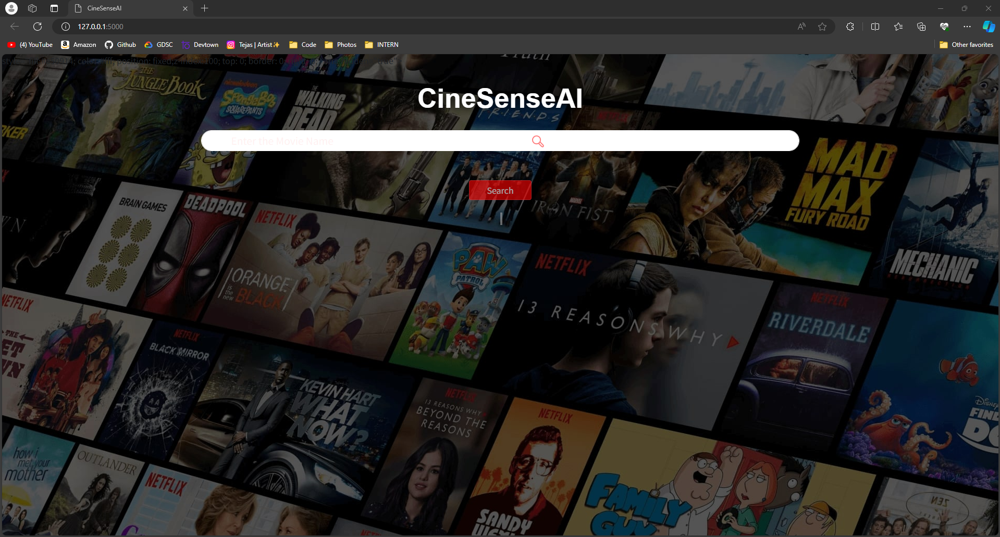

### README.md

# CineSenseAI

### AI-based Movie Recommendation System

## Project Description

The AI-based Movie Recommendation System is a web application designed to suggest movies to users based on their preferences and past viewing history. Leveraging advanced machine learning algorithms, natural language processing techniques, and cosine similarity, the system provides personalized movie recommendations to enhance the user experience. The project is built using a robust stack of technologies and libraries to ensure efficient performance and scalability.

We made this project for the project submission of the subject: 'Artificial Intelligence' in the curriculum. 

## Technologies and Libraries Used

- **Flask:** Serves as the core web framework to build and run the web application, facilitating routing, request handling, and rendering templates.
- **Gunicorn:** A WSGI HTTP server for running the Flask application in a production environment.
- **Jinja2:** A templating engine for Python used within Flask to render HTML templates dynamically.
- **MarkupSafe:** Ensures safe handling of strings in Jinja2 templates.
- **Werkzeug:** A comprehensive WSGI web application library used by Flask for various utilities and middleware support.
- **NumPy:** Provides support for large, multi-dimensional arrays and matrices, along with a collection of mathematical functions to operate on these arrays.
- **SciPy:** Used for advanced scientific computations and technical computing tasks.
- **NLTK:** Natural Language Toolkit for processing and analyzing human language data, crucial for text processing and feature extraction.
- **Scikit-learn:** A machine learning library used for implementing and training recommendation algorithms.
- **Pandas:** Essential for data manipulation and analysis, enabling efficient handling of structured data.
- **BeautifulSoup4:** A library for parsing HTML and XML documents, useful for web scraping and data extraction.
- **JSONSchema:** Used for validating JSON data structures.
- **TMDbv3API:** A wrapper for The Movie Database (TMDb) API, allowing access to a vast collection of movie data and metadata.
- **lxml:** A library for processing XML and HTML, used for web scraping tasks.
- **urllib3:** A powerful HTTP library for making requests and handling responses.
- **Requests:** Simplifies sending HTTP requests and interacting with web services.
- **Pickleshare:** A small 'shelve'-like database with concurrency support, used for session management or caching.

## Additional Technologies

- **HTML, JavaScript, AJAX:** Utilized for creating the front-end of the application, ensuring a responsive and dynamic user interface. AJAX allows for asynchronous data fetching and updating the web page without reloading.
- **Pickle:** Used for serializing and deserializing Python objects, essential for saving trained machine learning models and loading them efficiently.

## Machine Learning and NLP

- **NLTK, Scikit-learn, Pickle:** These libraries form the backbone of the recommendation engine, enabling the processing of textual data, feature extraction, and model training. The machine learning models are trained using Scikit-learn and serialized with Pickle for later use in making real-time recommendations.

## Cosine Similarity

Cosine similarity is used to measure the similarity between two non-zero vectors of an inner product space. In this project, it helps in comparing the user preferences with the movie features to provide accurate recommendations. Cosine similarity is particularly effective in high-dimensional spaces and is widely used in information retrieval and text mining.


## How to run the project?

1. Clone or download this repository to your local machine.
2. Go to the directory.
3. Open the terminal.
4. Install all the libraries mentioned in the [requirements.txt] file with the command 
```pip install -r requirements.txt```

5. Open your terminal/command prompt from your project directory and run the file `main.py` by executing the command `python main.py`.
6. Go to your browser and type `http://127.0.0.1:5000/` in the address bar.
7. Hurray! That's it.

## Usage

1. **Home Page:** Enter your movie preferences.
2. **Get Recommendations:** Click the 'Search' button to receive personalized movie suggestions.

## Screenshots

### Home Page


### Recommendations Page


## License

This project is licensed under the MIT License. See the [LICENSE](LICENSE) file for details.

---
